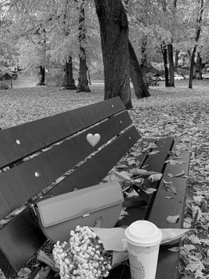

# Image processing API using Type Script and Express

The project aims to develope a backend API using Type Script and Express for processing images uploaded by the users.
The API will provide various image processing functionalities such as resizing, cropping, filtering, and water marking .It will allow users to upload images, apply different transformation, and download the processed images. The project will focus on efficient image processing  technique and error handling.

# Features
1. **Image Upload** : Users can upload images to the server
2. **Image Resizing**: Users can resize the image to specified dimensions
3. **Image Cropping**: Users can crop the image to a specified area
4. **Image Download**: Users can download the processed image.
5. **Image Filtering**: Implement various image filters such as grayscale and blur.
6. **Watermarking**: Add a watermark to image.
7. **Error Handling**: Implement robust error handling to handle various exceptions.

## Technologies Used
- Type Script
- Express.js
- sharp(for a efficient image processing)

## Installation
To run the project locally, follow these steps:

1. clone the repository:
```
git clone https://github.com/Muna-Zeer/Muna-Zeer-typescript.git
```
2. Install dependencies:
```
npm  install 
```

3. Build and run the project
```
npm run build
npm start
```
* This will build the TypeScript code into JavaScript and start the Express server.

## API Documentation

1.  Endpoints
POST /api/upload

- Uploads an image to the server.- Parameters: image (multipart/form-data)
- Returns: JSON with success message or error details.
GET /api/resize

2. Resizes an image.
- Parameters: image (filename), width (number), height (number)
- Returns: Resized image file or error details.
POST /api/crop

3. Crops an image.
- Parameters: image (filename), left (number), top (number), width (number), height (number)
- Returns: Cropped image file or error details.
GET /api/download

4. Downloads a processed image.
- Parameters: image (filename)
- Returns: Downloaded image file or error details.


**Images**
- The images are stored in the `uploads ` folder

### Images

<div style="border: 1px solid #ccc; padding: 10px; margin-right:10px;display: flex; flex-wrap: wrap; gap: 10px;">
    <div style="width: 400px;">
        
    </div>
    <div style="width: 100px;">
        
    </div>
    <div style="width: 100px;">
        
    </div>
    <div style="width: 100px;">
        
    </div>
    <div style="width: 100px;">
        
    </div>
    <div style="width: 100px;">
        
    </div>
    <div style="width: 100px;">
        
    </div>
    <div style="width: 100px;">
        
    </div>
    <div style="width: 100px;">
        
    </div>
    <div style="width: 100px;">
        
    </div>
    <div style="width: 100px;">
        
    </div>
    <div style="width: 100px;">
        
    </div>
  
  
  
   
  
 
  
</div>

